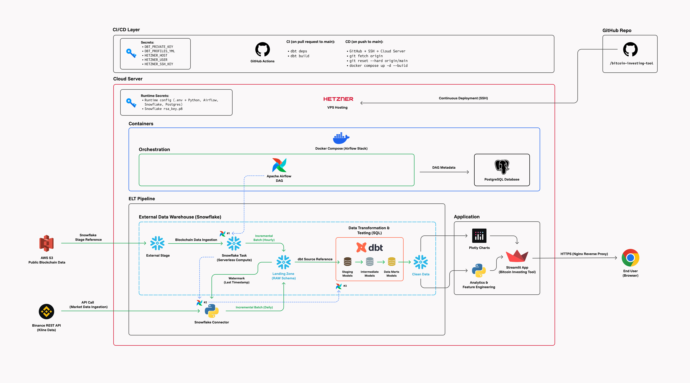

## **Bitcoin Investing Tool**

An end-to-end data engineering project and analytical application designed to support long-term Bitcoin investing.

https://bitcoin-investing-tool.streamlit.app

------------------------------------------------------------------------

## **Architecture**



------------------------------------------------------------------------

## **Overview**

The project is built around a modular ELT pipeline with clear separation
of responsibilities:

-   Data ingestion from external sources (`Binance API` and `AWS S3`)
-   Storage in a cloud-based data warehouse (`Snowflake`)
-   Transformation and testing using `dbt`
-   Orchestration with `Apache Airflow`
-   Serving layer via `Streamlit` application
-   Deployment and infrastructure using `Docker` and cloud hosting
-   CI/CD integration via `GitHub Actions`

The pipeline is designed to operate incrementally using a watermark
(last timestamp), ensuring efficient processing and avoiding full data
reloads.

------------------------------------------------------------------------
## **Application**


### **Key Components**

- **Bitcoin Price Chart (Weekly Interval)**
  - Main analytical view focused on long-term trends
  - Weekly granularity is used to reduce noise and support strategic decision-making
  - Daily interval is available for deeper analysis when needed

- **Supertrend Indicator**
  - Primary analytical tool used in the application
  - Helps identify long-term trend direction and potential reversal points
  - Has proven effective in capturing major market cycles

- **Market Summary**
  - Aggregated view of market metrics
  - Provides quick situational awareness for the current market state

- **Whale Inflow Monitoring**
  - Tracks large-volume movements on the blockchain
  - Based on on-chain data
  - Updated hourly to help detect potential accumulation or distribution phases

### **Design Assumptions**

The application is optimized for long-term investing:

- Focus on higher timeframes (weekly data)
- Limited need for high-frequency ingestion (daily batches are sufficient)
- Separation of data sources:
  - market data (daily)
  - blockchain data (hourly)

This design ensures that the data pipeline directly supports the analytical goals of the application.

## **Tech Stack**

**Languages, Frameworks and Environments:**

    > Python
    > SQL
    > Docker / Docker Compose
    > Streamlit
    > GitHub Actions

**Data Engineering and Orchestration:**

    > Apache Airflow
    > dbt
    > Snowflake

**Libraries and Packages:**

    > pandas
    > numpy
    > plotly
    > snowflake-connector-python

**Monitoring (not included in the architecture graph):**

    > Prometheus
    > Grafana
    

## **Getting Started**

``` bash
git clone https://github.com/your-username/bitcoin-investing-tool
cd bitcoin-investing-tool

cp .env.example .env

docker compose up --build
```

